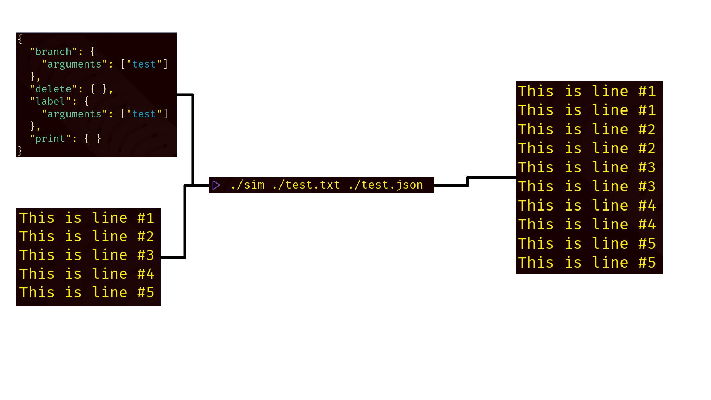

# :trophy: sim
`sed` improved!

`sed` is an awesome tool, the Swiss army knife of text editing tools. However,
in my opinion, it is a little opaque in exactly what it does. This repository
looks to created a `sed`-like program which is user friendly and self
documenting.

Given that the users of `sim` are likely to be developers themselves I have
written this program to be *super* customizable/hackable with very basic
knowledge of how the codebase works.

# :notebook: sim Model of Execution
As it is currently set up the way in which you interface with `sim` is via a
json schema with the file which you wish to edit (streams will be supported at
some point in the future see #1. Let's go through an in depth example:



The way in which `sim` works is by parsing json objects in *order* in the input
file and converting them to a type called a `Command`. From here the following
is the control flow of `sim`:
  
  1. Read one line of input from the text file the user wishes to process.
  2. This line is then put into a stream which is called the
     `operateration_stream` (called the pattern space in the GNU `sed` manual).
  3. In order execute each command using the read line of input as the input to
     that command. Note that some commands can manipulate the
     `operateration_stream`. Additionally, some commands can interact with a
     separate unchanging stream called the `static_stream` (called the hold
     space in GNU `sed` manual). Note here that each command has an `address`
     field which can be set for the command to only be executed on a certain
     line.
  4. Store the `operateration_stream` to be printed.
  5. Replace the `operateration_stream` with the next line in the file (if there
     is no next line finish execution) then go to step 1.

In the above example we interact with the following commands:
  - branch: this command will jump to the label with its argument.
  - delete: this command will delete the current `operateration_stream` and
    proceed to the next line without executing anymore commands.
  - label: a label which can be referenced.
  - print: this command will store the `operateration_stream` to be printed.

So looking at our above process, we see the following (I am taking only the
first line for the example):
  1. Read `This is line #1`.
  2. Store `This is line #1` in the `operateration_stream`.
  3. Start executing the commands in order line by line.
    3.1. Execute `branch` -> skip over `delete` and execute `label` and forward.
    3.2. Execute `label` -> make sure it is valid (this one is).
    3.3. Execute `print` -> store the `operateration_stream` to be printed.
  4. Store the `operateration_stream` to be printed. Here our
     `operateration_stream` looks like `This is line #1\nThis is line #1`
  5. Continue for the rest of the lines, hence the depicted output.

For a full list of commands see the
[command list](https://github.com/millipedes/sedim/tree/develop/docs/user/command_list.md).

Additionally much of this process is hackable, to see how see the
[hacking sim page](https://github.com/millipedes/sedim/tree/develop/docs/dev/hacking_sim.md).

# :hammer: Building sim
The build system which I have built `sim` on is `cmake`. I personally develop on
debian so I will walk through how to build `sim` using debian's `apt` package
manager but the process should be very similar for other package managers. First
we need to make sure that we have `gnu make`, `cmake`, and a C++ compiler:
```
sudo apt update && sudo apt upgrade
sudo apt install cmake make gcc
```

Next we need to get the dependencies of `sim`:
```
# Note if you do not want to build the tests binary you can skip libgtest-dev
sudo apt install libexpected-dev nlohmann-json3-dev libgtest-dev
```

Finally we can start building. From the root of this cloned repository:
```
mkdir build
cd build
# If you want to build the tests:
cmake ..

# Otherwise if you do not want to build the tests this command in place of
# "cmake ..":
# cmake -DBUILD_TESTS=OFF
```

And now you can start running `sim`!

# :thought_balloon: Design Decisions
My personal opinion of GNU `sed` is that is is relatively hard to get into. The
documentation is fine, but the way in which the user interacts with `sed` is a
little arcane, but it is such a cool tool. For this reason I wanted to write a
version of `sed` which would have an easier to use interface, hence I chose a
verbose way of expressing the commands to the tool, a json schema. This schema
will accept those `Command`s by their `sed` name but also have more verbose
names as an option as well.

But the main goal was to make `sed` easier to use and learn and json does have
its own downsides. For this reason, I have designed this implementation to be
able to change the way in which commands are passed to `sim` with little
knowledge of the codebase.

Additionally, I have written the way in which `Command`s are processed in a
similar way to allow for new `Command`s to be written without much knowledge of
the surrounding codebase.

To see how to change the front end from json to your preference of encoding
commands or to see how to add commands see the
[hacking sim page](https://github.com/millipedes/sedim/tree/develop/docs/dev/hacking_sim.md).

# Examples
See #3, but in the meantime, check out the `ExecutionTest`s which document the
functionality of the commands [here](https://github.com/millipedes/sedim/tree/develop/test/ExecutionTests.cpp).
